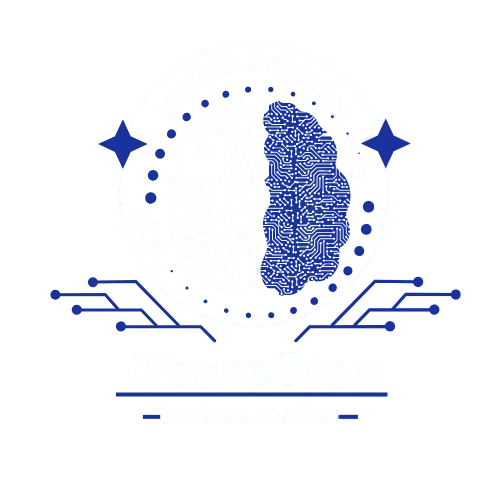

# 🤖 Neurostax ML Chatbot - Complete Machine Learning Journey



## 🧠 Introduction
Welcome to the Neurostax Machine Learning Chatbot Project - an open-source initiative designed to democratize AI and foster collaborative development in conversational AI. This repository serves as both a learning platform and a collaborative space where developers, data scientists, and AI enthusiasts can contribute to building intelligent chatbot solutions.

At Neurostax, we believe in the power of community-driven innovation. This project provides a structured pathway from basic chatbot concepts to advanced machine learning implementations, creating a comprehensive resource for anyone interested in natural language processing and conversational AI.


## 🎯 What You'll Build


This project is structured in **phases** to help contributors and learners progress step by step.  

| Phase     | Focus                          | Technology Stack                  | Outcome                                          |
|-----------|-------------------------------|-----------------------------------|-------------------------------------------------|
| **Phase 1** | Foundations & Basic NLP        | NLTK, Scikit-learn                | Rule-based chatbot with basic pattern matching   |
| **Phase 2** | Machine Learning Integration   | PyTorch, Neural Networks          | Intelligent intent classification                |
| **Phase 3** | Advanced AI Features           | Context Management, Sentiment Analysis | Professional-grade conversational AI         |

---

💡 *Each phase builds on the previous one, ensuring contributors gain both **theoretical knowledge** and **hands-on experience** as they move forward.*  

## 📋 Table of Contents
🚀 Quick Start

🎯 Project Overview

🏗️ Architecture

📁 Repository Structure

🔧 Installation & Setup

💡 Learning Path

🤝 How to Contribute

📊 Performance

📞 Support & Community


## 🚀 Quick Start
Prerequisites
Python 3.8+

Git

Basic understanding of Python and machine learning concepts

### Installation
```
# Clone the repository
git clone https://github.com/Neurostax/Machine_Learning.git
cd phase-1-rule-based
cd phase-2-ml-intent
cd phase-3-transformers

# Create virtual environment
python -m venv neurostax_env
source neurostax_env/bin/activate  # On Windows: neurostax_env\Scripts\activate

# Install dependencies
pip install -r requirements.txt

# Download NLTK data
python -c "import nltk; nltk.download('punkt'); nltk.download('wordnet')"
```

##Run Your First Chatbot
```
# Phase 1 - Basic Chatbot
cd phase-1-rule-based
cd Examples
python sample_bot.py

# Phase 2 - ML-Powered Chatbot  
cd phase-2-ml-intent
python data_preparation.py
python model_training.py
python mi_chatbot.py

# Phase 3 - Advanced AI Chatbot
cd phase-3-transformers

```

## 🎯 Project Overview
Our Mission
At Neurostax, we believe in democratizing AI. This repository serves as a comprehensive learning platform that takes developers from zero to hero in building production-ready chatbots using machine learning.

## Key Features
🧠 Progressive Learning: Start simple, advance gradually

📚 Comprehensive Documentation: Every line explained

🔬 Hands-on Experiments: Learn by building

🏗️ Production Ready: Industry-best practices

## 🏗️ Architecture

graph TB
    A[User Input] --> B[Text Preprocessing]
    B --> C[Intent Classification]
    C --> D[Context Manager]
    D --> E[Response Generator]
    E --> F[User Output]
    
    G[Training Data] --> H[Model Trainer]
    H --> I[Neural Network]
    I --> C
    
    J[Sentiment Analyzer] --> D
    K[Entity Recognizer] --> D


## 🛠 Technology Stack  

The chatbot project is built with a **layered architecture**, combining tools and frameworks from frontend to DevOps:  

| Layer         | Technologies                  |
|---------------|-------------------------------|
| **Frontend**  | Streamlit, Flask (optional)   |
| **Backend**   | Python, PyTorch               |
| **NLP**       | NLTK, SpaCy                   |
| **ML Framework** | PyTorch, Scikit-learn      |
| **Data**      | JSON, Pickle                  |
| **DevOps**    | Git, GitHub Actions           |

---

💡 *This modular tech stack ensures that the project remains flexible, scalable, and easy for contributors to extend with new features.*  


## 📁 Project Structure

chatbot-learning-path/
├── phase-1-rule-based/
│   ├── README.md
│   ├── requirements.txt
│   └── examples/
├── phase-2-ml-intent/
│   ├── README.md
│   ├── requirements.txt
│   └── datasets/
├── phase-3-transformers/
│   ├── README.md
│   ├── requirements.txt
│   └── models/
└── final-project/
    ├── README.md
    └── requirements.txt


# 💡 Learning Path  

The learning journey is divided into **three progressive phases**. Each phase builds on the previous one, ensuring contributors gradually move from **basic chatbot concepts** to a **production-ready conversational AI system**.  

---

## 📘 Phase 1: Foundations  

🎯 **Goal:** Understand basic NLP concepts and rule-based systems.  

| Week | Topics                           | Deliverables             |
|------|----------------------------------|--------------------------|
| 1    | Text preprocessing, Tokenization | Basic pattern matcher    |
| 2    | Stemming, Bag-of-Words           | Intent classification    |
| 3    | Response selection, Basic UI     | Functional chatbot       |

**Key Concepts:**  
- Tokenization  
- Stemming  
- Pattern Matching  
- JSON Data Structures  

---

## 🤖 Phase 2: ML Integration  

🎯 **Goal:** Implement machine learning for intelligent responses.  

| Week | Topics                              | Deliverables           |
|------|-------------------------------------|------------------------|
| 1    | Neural Networks, PyTorch basics     | Model architecture     |
| 2    | Training pipelines, Data preparation| Trained model          |
| 3    | Model evaluation, Hyperparameter tuning | Optimized classifier |
| 4    | Integration, Deployment             | ML-powered chatbot     |

**Key Concepts:**  
- Neural Networks  
- Training Loops  
- Model Evaluation  
- PyTorch  

---

## 🚀 Phase 3: Advanced Features  

🎯 **Goal:** Build production-ready AI with advanced capabilities.  

| Week | Topics                              | Deliverables             |
|------|-------------------------------------|--------------------------|
| 1    | Context management, Conversation flow | Context-aware bot       |
| 2    | Sentiment analysis, Emotional AI    | Emotion detection        |
| 3    | Entity recognition, Personalization | Smart entity extraction  |
| 4    | Advanced training techniques        | Production model         |
| 5    | Web integration, APIs               | Deployable application   |

**Key Concepts:**  
- Context Management  
- Sentiment Analysis  
- Entity Recognition  
- Production Deployment  

---

💡 *This structured path ensures contributors gain both **theoretical knowledge** and **hands-on experience**, making the learning process engaging and collaborative.*  


# 🤝 How to Contribute
We love our contributors! Here's how you can join our mission:

## 🎯 Contribution Workflow
1.Fork the Repository
```
# Click 'Fork' on GitHub UI, then:
git clone https://github.com/Neurostax/Machine_Learning.git
cd phase-1-rule-based
cd phase-2-ml-intent
cd phase-3-transformers
```

2.Create a Feature Branch

```
git checkout -b feature/Neurostax/amazing-feature
# or
git checkout -b fix/Neurostax/bug-description
```

3.Commit and Push
```
git add .
git commit -m "Add amazing feature: description of changes"
git checkout -b feature/Neurostax/amazing-feature
```

4.Create Pull Request
Go to GitHub repository

Click "New Pull Request"

Describe your changes thoroughly

Wait for review


# 🏆 Contribution Areas  

We welcome contributions from developers, researchers, writers, and enthusiasts of all levels.  
Here are the key areas where you can make an impact:  

| Area              | Skills Needed             | Good First Issues                              |
|-------------------|---------------------------|-----------------------------------------------|
| **Documentation** | Writing, Technical knowledge | 📚 Update guides, Fix typos                   |
| **Code Improvements** | Python, ML basics        | 🔧 Optimize code, Add comments                |
| **New Features**  | PyTorch, NLP              | 🎨 Add new intents, Enhance models            |
| **Testing**       | pytest, Unit testing      | ✅ Add test cases, Improve coverage           |
| **Web Integration** | Flask / Streamlit        | 🌐 Create web interfaces                      |

---

💡 *No matter your background — whether you’re a beginner or an expert — there’s always a way to contribute and grow with the **Neurostax ML Chatbot Project*** 🚀.  


# Sample Conversations
Phase 1 (Basic):


# 📞 Support & Community  

We believe in **learning together** and fostering an open community around this project.  
Here’s how you can get help or join the conversation:  

---

## 🆘 Getting Help  

- 📚 **Documentation** → Start by checking our [docs](./docs) for setup guides, tutorials, and learning resources.  
- 🐛 **Issues** → Found a bug or want to request a feature? Open a new [GitHub Issue](../../issues).  
- 💬 **Discussions** → Have questions, ideas, or want to connect with other contributors? Join our [GitHub Discussions](../../discussions).  
- 📧 **Email** → For direct communication, reach out at **neurostaxorg@gmail.com**.  

---

💡 *Whether you’re fixing bugs, adding features, or just exploring, you’re not alone — the **Neurostax ML Chatbot community** is here to support you.*  


# 👥 Community Channels  

The **Neurostax ML Chatbot Project** is more than just code — it’s a community.  
We encourage everyone to share, learn, and grow together through the following channels:  

- 💬 **GitHub Discussions** → For technical Q&A, brainstorming, and sharing ideas.  
- 🎧 **Discord Server** → Join us for real-time collaboration, support, and casual community chats.  
- 📅 **Monthly Meetups** → Virtual learning sessions where contributors present progress, share insights, and discuss future goals.  
- 🌟 **Contributor Spotlight** → Every month we highlight top contributors who’ve made significant impacts on the project.  

---

💡 *Stay connected, collaborate in real time, and be recognized for your contributions — because at **Neurostax**, community comes first.*  


# 🙏 Acknowledgments  

We would like to extend our gratitude to everyone who makes this project possible:  

- 👩‍💻 **Contributors** → Thank you to all our amazing contributors for your time, effort, and passion.  
- 🌍 **Open Source Community** → For the incredible tools, libraries, and frameworks that power this project.  
- 🧠 **Neurostax Team** → For supporting and driving this educational initiative forward.  
- 🙌 **You** → For joining us on this machine learning journey and being part of our growing community!  

---

💡 *Together, we’re not just building a chatbot — we’re building a community of learners and innovators.*  


# 🎯 Getting Started Checklist  

Follow these steps to kick off your journey with the **Neurostax Machine Learning Community**:  

- 🍴 **Fork the repository** → Start by creating your own copy of this repo.  
- ⚙️ **Set up your development environment** → Install the required dependencies and tools.  
- 📘 **Complete Phase 1 exercises** → Begin with the basics of NLP and rule-based chatbots.  
- 👥 **Join our community channels** → Connect with other learners via Discussions, Discord, and Meetups.  
- 💻 **Make your first contribution!** → Start small with documentation or a `good-first-issue`.  
- 🌟 **Share your learning journey** → Inspire others by posting about your progress.  

---

✅ **Ready to start?** Head over to **Phase 1** and begin your machine learning journey today!  

This repository is maintained with ❤️ by the **Neurostax Machine Learning Community**.  
Together, we're building the future of **AI and Machine learning**.  
